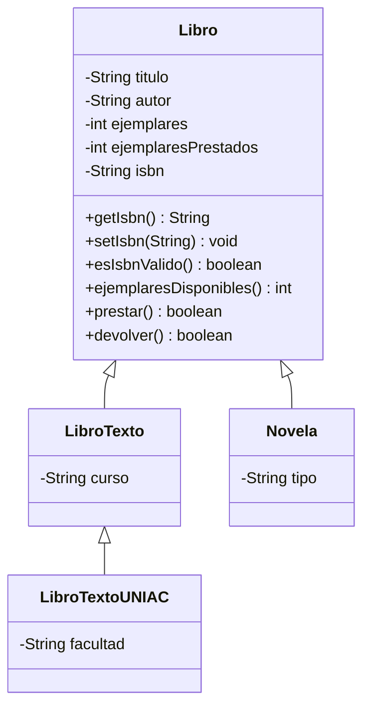

Nombre: Juan Sebastian Diaz Valencia

# Biblioteca: herencia y UML

## Diagrama de clases



`Libro` es la clase base. `LibroTexto` y `Novela` heredan de ella, mientras que
`LibroTextoUNIAC` especializa a `LibroTexto`. El ISBN y sus operaciones se
heredan desde `Libro` y pueden inicializarse desde los constructores de las
subclases.

## Atributo y método de ISBN

La clase `Libro` incorpora el atributo privado `isbn`, sus métodos de acceso y
`esIsbnValido()`, que verifica el dígito de control ISBN-13. Las subclases
disponen de constructores con ISBN; los constructores anteriores se conservan
y dejan este atributo en `null`. 

## Situaciones de herencia no permitidas

Los siguientes ejemplos son intencionalmente inválidos y no deben agregarse al
código ejecutable. Representan restricciones del lenguaje Java:

1. **Herencia múltiple de clases:** una clase no puede extender dos clases.

   ```java
   class LibroHibrido extends Libro, Novela { }
   ```
   Para compartir varios contratos se pueden implementar interfaces; para
   reutilizar comportamiento se puede componer un objeto.
2. **Acceso directo a atributos privados:** una subclase hereda el estado, pero
   no puede acceder al atributo privado `titulo` por su nombre.

   ```java
   class LibroEspecial extends Libro {
       String mostrarTitulo() {
    	   return titulo;
       }
   }
   ```
   Debe utilizarse `getTitutlo()` o definir un método protegido cuando exista
   una razón para habilitar ese acceso.
3. **Extender una clase `final`:** una clase declarada `final` no admite
   subclases.

   ```java
   final class LibroSellado { }
   class LibroDerivado extends LibroSellado { }
   ```
4. **Invocar el constructor de la subclase desde la superclase:** el constructor
   de una superclase no puede llamar a `super()` para construir su subclase. La
   llamada a `super(...)` pertenece al constructor de la subclase y debe ser su
   primera instrucción.
